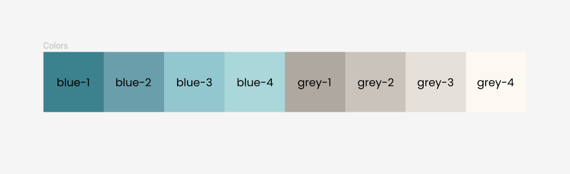

## Don't use export default

```ts
//export default function FeedbackPage() {
export function FeedbackPage() {
```

## Name your components properly

- Always start with a capital letter

- If it's a page, it should end with `Page`:

    ```ts
    function TestPage() {
    ````

## Place your components in the right place

- If you create a page, it should go in `src/pages`.
- If you create a component, it should go in `src/components`.
- If you some components related together, you can either (A) put them in the
same file, or (B) create a sub-directory like `src/components/writing` and put
your components there.


## Tailwind colors

You can use our specific colors, like `blue-4` in the following example:

```html
<h1 className="text-2xl text-blue-4 font-bold text-center mb-12">
    Writing 1
</h1>
```

Here are the colors for a reference:



